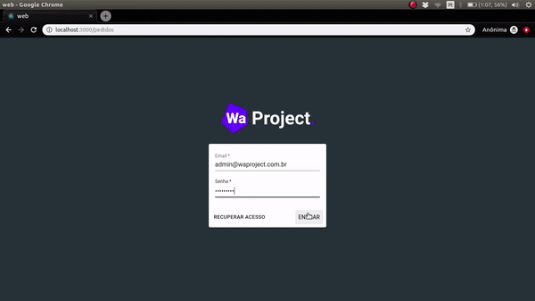

<h3 align="center">
  WA Project: Teste Prático
</h3>

<blockquote align="center">“Mude você e todo o resto mudará naturalmente”!</blockquote>

  

  <b>Obs.:</b> Ao subir a api foi necessário criar database `waproject`;

